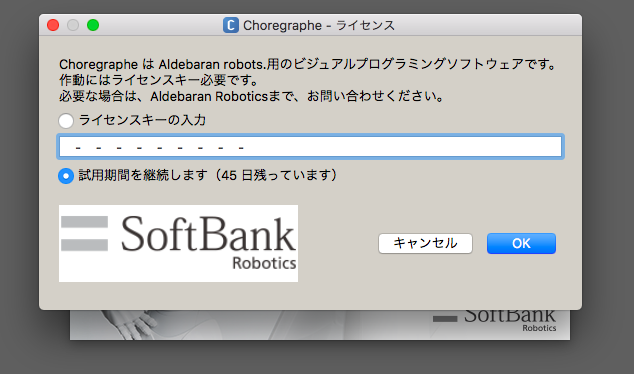
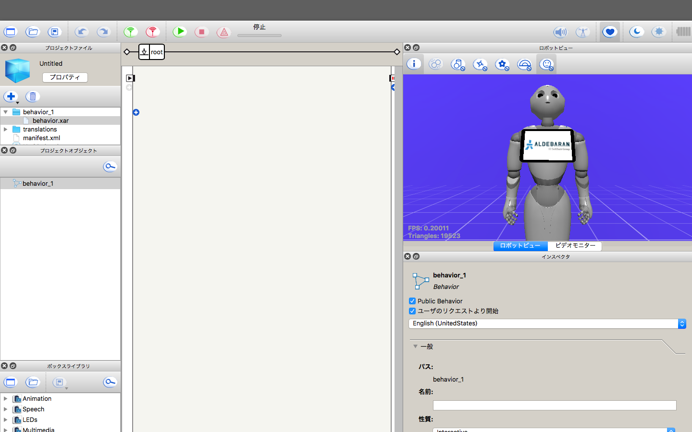
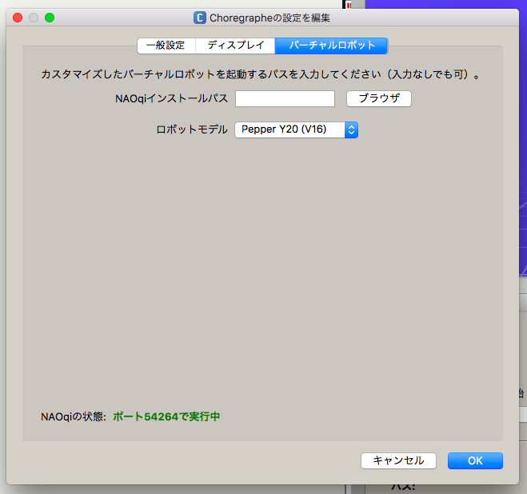
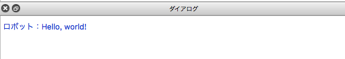
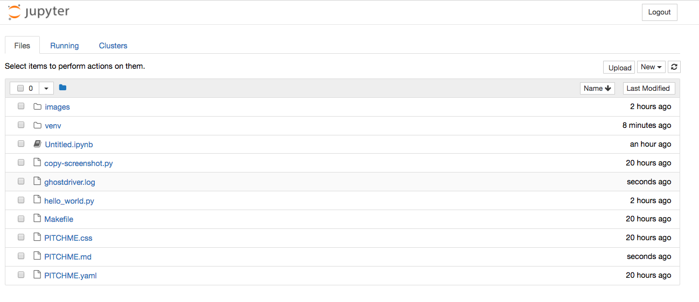
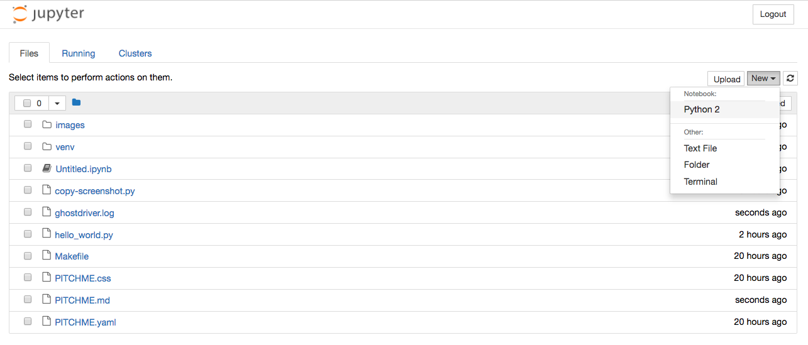
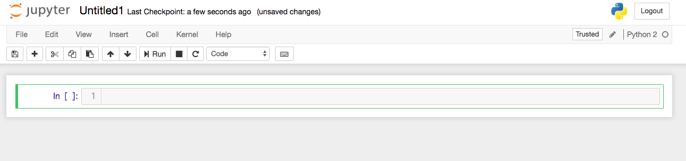
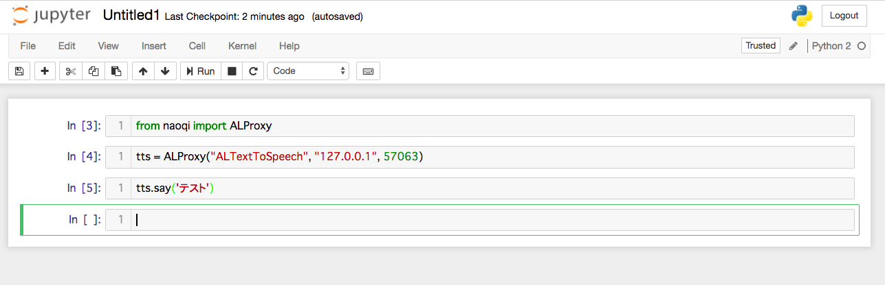
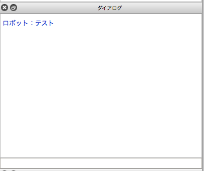

# Pepper Python チュートリアル

嶋田健志
(@TakesxiSximada)

---

## 今日のゴール

- Pythonの開発環境を構築する
- Pepperの開発環境を構築する
- Pepperを動かす
- Pepper + Pythonでプログラムを書いて実行する

---

## 環境

以下の環境を前提に作成しています。

他の環境をお使いの場合はサポートできない可能性があります。

- OS: macOS Sierra 10.12.4
- Python: Python 2.7

---

## Python 2.7 or 3.x ？

- Pythonには2.x系と3.x系がある
- pynaoqiはPython3.xに対応していない
- そのためPython2.xを使わざるをえない

---

## Pythonのバージョンを確認する

```
bash-3.2$ python -V
Python 2.7.13
```

+++

## Pythonが起動しない場合

```
bash-3.2$ python
bash: python: command not found
```

このようになった場合はPythoをインストールする必要がある

+++

## Pythonのインストール


https://www.python.org/downloads/


+++

## インストール方法

- Windows: https://qiita.com/taiponrock/items/f574dd2cddf8851fb02c
- macOS: https://qiita.com/ms-rock/items/6e4498a5963f3d9c4a67

---

## PythonでHello World

テキストエディタで開いて記述します。


hello_world.py

```
print 'Hello World'
```

記述したら、ファイルを保存します。

---

## Pythonを実行する

hello_world.py を実行します。


ターミナルに `python ファイル名` と入力して
エンターキーを押します。

```
$ python hello_world.py
Hello World
```

---

## Naoqi(ナオキ)のインストール

- PythonからPepperに接続をするためのライブラリ
- [pynaoqiのインストールガイド](http://doc.aldebaran.com/2-5/dev/python/install_guide.html)
- https://community.aldebaran.com/en/resources/software からダウンロード
  (アカウントの登録が必要)
- 必要なライブラリのファイルをダウンロードしてきて `$HOME/src/var/` 配下に解凍する
  (展開する場所はどこでもいいが、今回は `$HOME/src/var/` に固定する )

---

## pynaoqiの設定

- Pythonではライブラリのインストールは通常pipを使って行う
- pynaoqiはpipを使ってのインストール方法が準備されていない
- Pythonのライブラリ探索パスにpynaoqiへのパスを通すことで使える状態にする (これが公式の方法!!)

---

## pynaoqiの設定


```
$ export PYTHONPATH=${PYTHONPATH}:${HOME}/src/var/pynaoqi-python2.7-2.5.5.5-mac64/lib/python2.7/site-packages
$ export DYLD_LIBRARY_PATH=${DYLD_LIBRARY_PATH}:${HOME}/src/var/pynaoqi-python2.7-2.5.5.5-mac64/lib
```

- ${HOME}/src/var配下にtarballを展開した状態であることを前提としている
- 必要に応じてパスを書き換える必要がある

---

## pynaoqiが使えるようになったか確認する

使える状態

```
$ python -m naoqi
$
```

+++

## pynaoqiが使えるようになったか確認する

使えない状態

```
$ python -m naoqi
python -m naoqia
/Library/Frameworks/Python.framework/Versions/2.7/Resources/Python.app/Contents/MacOS/Python: No module named naoqi
```

- この場合、naoqiへのパスがPYTHONPATHに正しく設定されていない可能性がある
- `echo $PYTHONPATH` でPYTHONPATHを確認すると良い

---

ここまででPythonの基本的な環境は終わり

次はPepperの環境

---

## Choregrapheのインストール

---

## Choregrapheを起動する


---

## Choregrapheのライセンス入力画面

- ライセンスキーを持っていればライセンスキーを入力します。
- 今回は `試用期間を継続します。` を選択します。
- 公開ライセンスキー https://developer.softbankrobotics.com/jp-ja/downloads/pepper



---

## Choregrapheの起動画面

起動するとこのような画面になります。



---

# バーチャルロボット


---

## バーチャルロボットの設定

バーチャルロボットを使ってローカル環境でペッパーの操作を行う



---

## ポート番号を確認

- このポート番号につなぐことでPepperを遠隔で操作可能
- pynaoqiでは外部からPepperに接続してPepperを操作する機能が提供されている


---

## PepperにHello worldを言わせてみる

- naoqiを使ってPepperを操作する
- バーチャルロボットは音を発生させられない
- 発する音は文字列としてChoregrapheのダイアログに表示される


---

## PythonのInteractiveShellで実行

```
>>> from naoqi import ALProxy
>>> tts = ALProxy("ALTextToSpeech", "127.0.0.1", 54264)
[I] 1508488962.246104 775 qimessaging.session: Session listener created on tcp://0.0.0.0:0
[W] 1508488962.247009 4099 qi.path.sdklayout: No Application was created, trying to deduce paths
[I] 1508488962.247033 775 qimessaging.transportserver: TransportServer will listen on: tcp://10.27.40.30:55925
[I] 1508488962.247048 775 qimessaging.transportserver: TransportServer will listen on: tcp://127.0.0.1:55925
[I] 1508488962.247056 775 qimessaging.transportserver: TransportServer will listen on: tcp://192.168.99.1:55925
>>> tts.say("Hello, world!")
>>>
```

@[1](ALProxyをインポート)
@[2](第一引数はALTextToSpeech、第二引数はIPアドレス、第三引数はポート番号)
@[3-7](接続)
@[8](テキスト "Hello world!" をPepperに送信)

---

## ダイアログ



ロボットが発話する内容は `ロボット: xxxx` という形で表示されます。

---

## ALTextToSpeech以外を使ってみる

- せっかく色々Pepperを制御できるので色々触ってみましょう。

---

## Pepperを動かす

- Pepperには足元にホイールが付いているので躯体を移動できる
- ホイールの制御には `ALMotion` を使う
- http://doc.aldebaran.com/2-1/naoqi/motion/index.html

---

## 接続

```
>>> motion = ALProxy('ALMotion', '127.0.0.1', 56838)
[I] 1508492002.065112 775 qimessaging.session: Session listener created on tcp:/
/0.0.0.0:0
[I] 1508492002.065938 775 qimessaging.transportserver: TransportServer will list
en on: tcp://10.27.40.30:56852
[I] 1508492002.065968 775 qimessaging.transportserver: TransportServer will list
en on: tcp://127.0.0.1:56852
[I] 1508492002.065981 775 qimessaging.transportserver: TransportServer will list
en on: tcp://192.168.99.1:56852
>>>
```

---

## 前進/後退/停止

### 前進

```
>>> motion.moveToward(0.1,0.0,0.0)
```

### 後退

```
>>> motion.moveToward(-0.1,0.0,0.0)
```

### 停止

```
>>> motion.moveToward(0.0,0.0,0.0)
```

---

## 左右

### 左

```
>>> motion.moveToward(0.0,0.0,0.0)
```

### 右

```
>>> motion.moveToward(0.0,-0.1,0.0)
```

### 停止

```
>>> motion.moveToward(0.0,0.0,0.0)
```

---

## 回転

### 回れ右方向

```
>>> motion.moveToward(0.0,0.0,-0.1)
```

### 回れ左方向

```
>>> motion.moveToward(0.0,0.0,0.1)
```

### 停止

```
>>> motion.moveToward(0.0,0.0,0.0)
```

---

## 障害物を避けながら目的地に移動する

- Pepperは目的地までの経路に障害物があるとそれを避けて動くナビゲーション機能が提供されている
- `ALNavigation` を使う
- http://doc.aldebaran.com/2-1/naoqi/motion/alnavigation-api.html#ALNavigationProxy::navigateTo__floatCR.floatCR


---

## 障害物を避けながら目的地に移動する

```
>>> nav = ALProxy('ALNavigation', '127.0.0.1', 56838)
>>> nav.navigateTo(1, 1)
True
```

`nav.navigateTo(x, y)`

- x: 前後方向をfloatで指定(単位はメートル)。
- y: 左右方向をfloatで指定(単位はメートル)。
- 座標を指定するとまずは躯体を回転させて最短経路で移動
- 移動経路中に障害物があると回避

---

## ポーズをとってみる


```
>>> pos = ALProxy('ALRobotPosture', '127.0.0.1', 56838)
>>> pos.goToPosture('StandZero', 1.0)
True
>>> pos.goToPosture('Stand', 1.0)
True
>>> pos.goToPosture('StandInit', 1.0)
True
```

+++

## 最初は次のポーズしかない

- StandZero
- Standinit
- Stand
- Crouch

+++

- ポーズは自分でも作成できる
- 存在しないポーズを指定した場合はFalseがreturnされる


---

# 実機での動作

---

## バーチャルロボットではできない動作もある

- https://qiita.com/Atelier-Akihabara/items/a6a97c717c5f96daff1d
- できないことが結構ある
- 例えばLEDの制御やセンサーなどは扱えない

---

## 実機のIPアドレスを調べる

- 設定の画面からIPアドレスを表示する
- IPアドレスを喋らせる

---

## Pepperの目を光らせる

- ALProxy経由でPepperの目を光らせてみます
- LEDの操作なので `AllLeds` を使う
- http://doc.aldebaran.com/2-1/naoqi/sensors/alleds-api.html?highlight=alled#ALLedsProxy


---

## 接続する

```
>>> leds = ALProxy('ALLeds', '192.168.1.2', 54264)
```

---

## LEDグループ名を取得する

LEDには各パーツごとにLEDがいくつも付いています。それを一つずつ制御するのは大変なのでグループが作成できます。Pepperではすでにグループがいくつも作成されています。そのグループを取得してみましょう。

+++

```
>>> leds.listGroups()
['AllLeds', 'AllLedsBlue', 'AllLedsGreen', 'AllLedsRed', 'ChestLeds', 'EarLed1', 'EarLed10', 'EarLed
2', 'EarLed3', 'EarLed4', 'EarLed5', 'EarLed6', 'EarLed7', 'EarLed8', 'EarLed9', 'EarLeds', 'FaceLed
0', 'FaceLed1', 'FaceLed2', 'FaceLed3', 'FaceLed4', 'FaceLed5', 'FaceLed6', 'FaceLed7', 'FaceLedLeft
0', 'FaceLedLeft1', 'FaceLedLeft2', 'FaceLedLeft3', 'FaceLedLeft4', 'FaceLedLeft5', 'FaceLedLeft6',
'FaceLedLeft7', 'FaceLedRight0', 'FaceLedRight1', 'FaceLedRight2', 'FaceLedRight3', 'FaceLedRight4',
 'FaceLedRight5', 'FaceLedRight6', 'FaceLedRight7', 'FaceLeds', 'FaceLedsBottom', 'FaceLedsExternal'
, 'FaceLedsInternal', 'FaceLedsLeftBottom', 'FaceLedsLeftExternal', 'FaceLedsLeftInternal', 'FaceLed
sLeftTop', 'FaceLedsRightBottom', 'FaceLedsRightExternal', 'FaceLedsRightInternal', 'FaceLedsRightTo
p', 'FaceLedsTop', 'LeftEarLeds', 'LeftEarLedsBack', 'LeftEarLedsEven', 'LeftEarLedsFront', 'LeftEar
LedsOdd', 'LeftFaceLeds', 'LeftFaceLedsBlue', 'LeftFaceLedsGreen', 'LeftFaceLedsRed', 'RightEarLeds'
, 'RightEarLedsBack', 'RightEarLedsEven', 'RightEarLedsFront', 'RightEarLedsOdd', 'RightFaceLeds', '
RightFaceLedsBlue', 'RightFaceLedsGreen', 'RightFaceLedsRed']
```

---

## 全てのLEDを初期化する

AllLedsグループは全てのLEDを含んでいます。 `.reset()` を使って初期化しましょう。

```
>>> leds.reset('AllLeds')
>>>
```

---

## 顔のLEDを光らせる

```
>>> leds.fadeRGB('FaceLeds', 0xffb361, 0.1)
```


---

## Jupyter Notebook上でpynaoqiを使い制御する

---

## The Jupyter Notebook


The Jupyter Notebook is an open-source web application that allows you to create and share documents that contain live code, equations, visualizations and narrative text. Uses include: data cleaning and transformation, numerical simulation, statistical modeling, data visualization, machine learning, and much more.

※ http://jupyter.org/ 抜粋

+++

## The Jupyter Notebook

Jupyterノートブックは、ライブコード、方程式、視覚化、物語テキストを含むドキュメ
ントを作成して共有できるオープンソースのWebアプリケーションです。データの消去と
変換、数値シミュレーション、統計モデリング、データの視覚化、機械学習などがそれに
含まれます。

※ http://jupyter.org/ 翻訳

---

## Jupyter Notebookの準備

- jupyterをpipで入れたい
- jupyterを入れるためにはpipがないのでpipを入れる
- 直接pipでjupyterを入れてしまうと環境が汚れてしまうのでvirtualenvも入れる

+++

1. pipをインストールする
2. virtualenvをインストールする
3. jupyterをインストールする


---

## pip

- Pythonのパッケージマネージャー
- 3rd partyライブラリは通常このコマンドを使ってインストールする
- Python3.5 からはpipがPythonに梱包されるようになった
- 今回使用しているPythonは2.7なので自分でインストールしなければならない

---

## pipのインストール

https://bootstrap.pypa.io/get-pip.py をダウンロードする

```
python get-pip.py
```

詳しくはこちら https://pip.pypa.io/en/stable/installing/ 。

---

## virtualenv

- Pythonの環境分離ツール
- グローバルのPythonを汚すことなくライブラリを利用できる
- Python3.3系からはvenvという名称で標準モジュールとして取り込まれた
- 今回使用しているPythonは2.7なので自分でインストールしなければならない

---

## virtualenvのインストール


```
$ pip install virtualenv
```

---

## virtualenvでの環境の作成

- `virtualenv 環境名` で環境を作成する
- 環境名はなんでも良いが今回はvenvにする

```
$ virtualenv venv
virtualenv venv
New python executable in /Users/sximada/working/presentations/src/venv/bin/python
Installing setuptools, pip, wheel...done.
```

---

## 環境を適応する

- `source env/bin/activate` で環境を適応する
- 適応した状態で3rd party パッケージをインストールしてもグローバルを汚さない

```
$ source venv/bin/activate
source venv/bin/activate
(venv) bash-3.2$
```

---

## jupyterをインストールする

```
(venv) bash-3.2$ pip install jupyter
pip install jupyter
Requirement already satisfied: jupyter in ./venv/lib/python2.7/site-packages
...
...
(venv) bash-3.2$
```
---

## jupyterを起動する

- `jupyter notebook` で起動する
- 起動したらブラウザで `http://localhost:8888` を表示する (だいたい自動的に開く)

+++

```
(venv) bash-3.2$ jupyter notebook
jupyter notebook
[I 17:29:52.964 NotebookApp] Serving notebooks from local directory: /Users/sximada/working/presentations/src
[I 17:29:52.965 NotebookApp] 0 active kernels
[I 17:29:52.965 NotebookApp] The Jupyter Notebook is running at:
[I 17:29:52.965 NotebookApp] http://localhost:8888/?token=6d6bee8f35a06a86ff65bebec5ddb8081452820eb437ea47
[I 17:29:52.965 NotebookApp] Use Control-C to stop this server and shut down all kernels (twice to skip confirmation).
[C 17:29:52.967 NotebookApp]

    Copy/paste this URL into your browser when you connect for the first time,
    to login with a token:
        http://localhost:8888/?token=6d6bee8f35a06a86ff65bebec5ddb8081452820eb437ea47
[I 17:29:53.277 NotebookApp] Accepting one-time-token-authenticated connection from ::1
[W 17:29:55.098 NotebookApp] 404 GET /static/components/moment/locale/ja.js (::1) 20.60ms referer=http://localhost:8888/tree
```


---

## Jupyter notebookの起動画面



---

## Pythonを起動




---

## Jupyter notebookのnotebook画面



---

## Jupyter notebook上でpepperを制御



---

## バーチャルロボットのダイアログ




---

## 参考文献

- http://doc.aldebaran.com/2-5/dev/python/install_guide.html
- http://doc.aldebaran.com/1-14/getting_started/helloworld_python.html


---

# おしまい


+++

## このハンズオンの狙い

- Python
  - Pythonの環境を作る
  - Pythonスクリプトを書いて実行できるようになる
  - Pythonのインストーラや仮想環境周りの扱いに触れる
- Pepper
  - Pepperの開発環境 Choregraphe(コレグラフ) を入手する
  - Pythonライブラリ Naoqi(ナオキ) を入手する
  - Naoqiを使ってPepperを操作する
- 応用
  - Jupyter Notebookからやって見る
  - アプリを作成する
