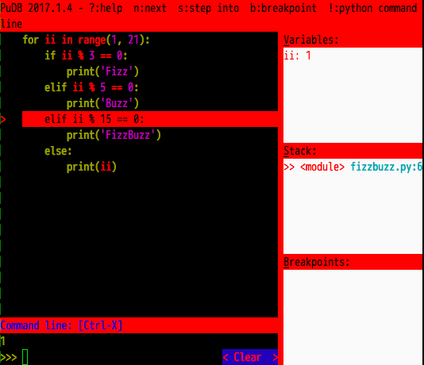
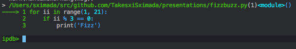
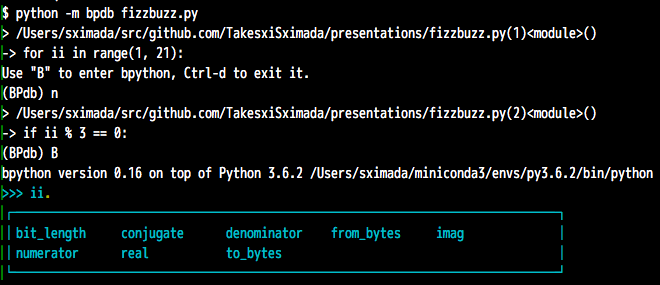

---



---

# Pythonにおける
# デバッグ手法

---

### 自己紹介

- 嶋田健志
- Twitter: @TakesxiSximada
- PythonとEmacs大好き
- フリーランスのWebエンジニア

+++

### 書籍関連

共著

- Pythonエンジニア ファーストブック
- Pythonエンジニア養成読本

(技術評論社)

+++

### 書籍関連

技術監修

- PythonとJavaScriptではじめるデータビジュアライゼーション
- Pythonではじめるデータラングリング
- PythonによるWebスクレイピング

(オライリージャパン)

---

### アジェンダ

- デバッグとは |
- 実際にデバッグする |
- 様々なデバッガの紹介 |
- 様々な環境でのデバッグ方法 |
- デバッグ関連の失敗談と対処方法 |

---

### デバッグとは

---

### デバッグとは...

デバッグ（debug）とは、コンピュータプログラムや電気機器中のバグ・欠陥を発見および修正し、動作を仕様通りのものとするための作業である。

[Wikipedia](https://ja.wikipedia.org/wiki/%E3%83%87%E3%83%90%E3%83%83%E3%82%B0)より


---

# 実際にデバッグする

---

### fizzbuzz

- 1から始まる数字を標準出力に表示
- 3の倍数なら数字の代わりにFizzと表示
- 5の倍数なら数字の代わりにBuzzと表示
- 3と5の倍数なら数字の代わりにFizzBuzzと表示

※今回は1から20までを実施

---

### サンプル

fizzbuzz.py

```
for ii in range(1, 21):
    if ii % 3 == 0:
        print('Fizz')
    elif ii % 5 == 0:
        print('Buzz')
    elif ii % 15 == 0:
        print('FizzBuzz')
    else:
        print(ii)
```

---

### 実行してみる

```
$ python fizzbuzz.py
1
2
Fizz
4
Buzz
Fizz
7
8
Fizz
Buzz
```

@[1]
@[2]
@[3]
@[4]
@[5]
@[6]
@[7]
@[8]
@[9]
@[10]
@[11]

+++

### 続き

```
11
Fizz
13
14
Fizz
16
17
Fizz
19
Buzz
```

@[1]
@[2]
@[3]
@[4]
@[5]
@[6]
@[7]
@[8]
@[9]
@[10]
@[11]

`FizzBuzz` という表示が1個もない

---

### デバッグのために表示を追加

```
for ii in range(1, 21):
    print('CURRENT: {}'.format(ii))  # 追加
    if ii % 3 == 0:
        print('Fizz')
    elif ii % 5 == 0:
        print('Buzz')
    elif ii % 15 == 0:
        print('HIT')  # 追加
        print('FizzBuzz')
    else:
        print(ii)

```

@[2](現在の数値を表示)
@[8](3の倍数かつ5の倍数の条件に入ったらHITを表示)

---

##### 実行

```
$ python  example_fizzbuzz.py
CURRENT: 1
1
CURRENT: 2
2
CURRENT: 3
Fizz
CURRENT: 4
4
CURRENT: 5
Buzz
CURRENT: 6
Fizz
CURRENT: 7
7
CURRENT: 8
8
CURRENT: 9
Fizz
CURRENT: 10
Buzz
```

見やすい

+++

##### 実行

```
CURRENT: 11
11
CURRENT: 12
Fizz
CURRENT: 13
13
CURRENT: 14
14
CURRENT: 15
Fizz
CURRENT: 16
16
CURRENT: 17
17
CURRENT: 18
Fizz
CURRENT: 19
19
CURRENT: 20
Buzz
```

@[9-10](15がFizz！！正しくはFizzBuzz)


---

##### 処理を追いかける

```
for ii in range(1, 21):
    print('CURRENT: {}'.format(ii))  # 追加
    if ii % 3 == 0:
        print('Fizz')
    elif ii % 5 == 0:
        print('Buzz')
    elif ii % 15 == 0:
        print('HIT')  # 追加
        print('FizzBuzz')
    else:
        print(ii)
```

@[1](iiが15の時)
@[3](15 % 3 == 0)
@[4](実行されてしまう)
@[5](最初のifが実行されたので実行されない)
@[7](最初のifが実行されたので実行されない)
@[10](最初のifが実行されたので実行されない)
@[1](次のターン！！)

---

# 🍅バグ🍅

### 3の倍数と5の倍数は
### 一番最初に調べる必要がありそう

---

##### コードを修正する

```
for ii in range(1, 21):
    print('CURRENT: {}'.format(ii))
    if ii % 15 == 0:
        print('HIT')
        print('FizzBuzz')
    elif ii % 3 == 0:
        print('Fizz')
    elif ii % 5 == 0:
        print('Buzz')
    else:
        print(ii)
```

@[3-5](一番最初に15を調べるように修正)

---

###### 実行

```
$ python example_fizzbuzz.py
CURRENT: 1
1
CURRENT: 2
2
CURRENT: 3
Fizz
CURRENT: 4
4
CURRENT: 5
Buzz
CURRENT: 6
Fizz
CURRENT: 7
7
CURRENT: 8
8
CURRENT: 9
Fizz
CURRENT: 10
Buzz
```

+++

###### 実行

```
CURRENT: 11
11
CURRENT: 12
Fizz
CURRENT: 13
13
CURRENT: 14
14
CURRENT: 15
HIT
FizzBuzz
CURRENT: 16
16
CURRENT: 17
17
CURRENT: 18
Fizz
CURRENT: 19
19
CURRENT: 20
Buzz
```

@[9-11](LGTM)

---

## printデバッグ

- 標準出力に値を出力することでデバッグ|
- もっとも基本的な手法 |
- どの言語でもよく使われる |

---

### アジェンダ

- ~~デバッグとは~~
- ~~実際にデバッグする~~
- 🍅 様々なデバッガの特徴
- 様々な環境でのデバッグ方法
- デバッグ関連の失敗談と対処方法

---

### printデバッグ

- 簡単で手っ取り早い
- 複雑な処理を追いかけづらい
- 表示してもよくわからないobjectもある
- (例) <__main__.Testing object at 0x108c4e160>

 ⬇

- 1行ずつ処理を確認しながら実行したい
- 実行中の変数も確認したい

---

# pdb

---

### pdb とは

- Python標準のデバッガ
- インストール不要
- CLI操作でデバッグを実行
- gdbに似ている (Cのデバッガ)

---

# 実行

```
$ python -m pdb fizzbuzz.py
> /Users/sximada/src/github.com/TakesxiSximada/presentations/fizzbuzz.py(1)<module>()
-> for ii in range(1, 21):
(Pdb)
```

@[1](スクリプト実行時に `-m pdb` を指定)
@[3-4](スクリプトの最初の処理で停止)

---

### 1行進む

```
(Pdb) n
> /Users/sximada/src/github.com/TakesxiSximada/presentations/fizzbuzz.py(2)<module>()
-> if ii % 3 == 0:
(Pdb)
```

@[1](n RETを入力)
@[3-4](1行実行し停止)

---

### 表示の解説

```
> /src/presentations/fizzbuzz.py(2)<module>()
```

- `> ファイルパス(実行している行数)関数名()`
- 今回は関数にしていないので関数名の所は `<module>` という表示
- 実際には\_\_name\_\_の値を表示


---

### 前回と同じ処理を実行

```
(Pdb)
> /Users/sximada/src/github.com/TakesxiSximada/presentations/fizzbuzz.py(4)<module>()
-> elif ii % 5 == 0:
(Pdb)
> /Users/sximada/src/github.com/TakesxiSximada/presentations/fizzbuzz.py(6)<module>()
-> elif ii % 15 == 0:
(Pdb)
```

@[1](RET)
@[2-3](実行)
@[4](RET)
@[5-6](実行)


---

### 現在どこの行を実行しているかを確認


```
(Pdb) l
  1     for ii in range(1, 21):
  2         if ii % 3 == 0:
  3             print('Fizz')
  4  ->     elif ii % 5 == 0:
  5             print('Buzz')
  6         elif ii % 15 == 0:
  7             print('FizzBuzz')
  8         else:
  9             print(ii)
[EOF]
```

@[1](lを入力)
@[5](次に実行される行)

---

### 処理を続行させる

```
(Pdb) c
2
Fizz
4
Buzz
〜 省略 〜
Fizz
19
Buzz
The program finished and will be restarted
> /Users/sximada/src/github.com/TakesxiSximada/presentations/fizzbuzz.py(1)<module>()
-> for ii in range(1, 21):
(Pdb)
```

@[1](cを入力)
@[2-9](処理が続行される)
@[10-13](再び最初から実行)

---

### break point

```
(Pdb) b 2
Breakpoint 1 at /Users/sximada/src/github.com/TakesxiSximada/presentations/fizzbuzz.py:2
(Pdb) c
> /Users/sximada/src/github.com/TakesxiSximada/presentations/fizzbuzz.py(2)<module>()
-> if ii % 3 == 0:
(Pdb)
```

@[1](b [行番号]を入力)
@[2](2行目にbreak pointが作成される)
@[3](cで処理を続行)
@[5-6](break pointで処理が停止)

---

### 値の表示

```
(Pdb) p ii
1
(Pdb)
```

@[1](pでiiを表示する)
@[2](1が表示される)
@[3](処理が停止)

---

### pdbを使ってFizzBuzzをデバッグ


```
$ python -m pdb fizzbuzz.py
> /Users/sximada/src/github.com/TakesxiSximada/presentations/fizzbuzz.py(1)<module>()
-> for ii in range(1, 21):
(Pdb) l
  1  -> for ii in range(1, 21):
  2         if ii % 3 == 0:
  3             print('Fizz')
  4         elif ii % 5 == 0:
  5             print('Buzz')
  6         elif ii % 15 == 0:
  7             print('FizzBuzz')
  8         else:
  9             print(ii)
[EOF]
```

+++

### 続き

```
(Pdb) b 2
Breakpoint 1 at /Users/sximada/src/github.com/TakesxiSximada/presentations/fizzbuzz.py:2
(Pdb) c
> /Users/sximada/src/github.com/TakesxiSximada/presentations/fizzbuzz.py(2)<module>()
-> if ii % 3 == 0:
(Pdb) c
1
> /Users/sximada/src/github.com/TakesxiSximada/presentations/fizzbuzz.py(2)<module>()
-> if ii % 3 == 0:
(Pdb) c
2
> /Users/sximada/src/github.com/TakesxiSximada/presentations/fizzbuzz.py(2)<module>()
-> if ii % 3 == 0:
c(Pdb) c
Fizz
> /Users/sximada/src/github.com/TakesxiSximada/presentations/fizzbuzz.py(2)<module>()
-> if ii % 3 == 0:
c(Pdb) c
4
```

+++

### 続き

```
> /Users/sximada/src/github.com/TakesxiSximada/presentations/fizzbuzz.py(2)<module>()
-> if ii % 3 == 0:
(Pdb) c
Buzz
> /Users/sximada/src/github.com/TakesxiSximada/presentations/fizzbuzz.py(2)<module>()
-> if ii % 3 == 0:
c(Pdb) c
Fizz
> /Users/sximada/src/github.com/TakesxiSximada/presentations/fizzbuzz.py(2)<module>()
-> if ii % 3 == 0:
c(Pdb) c
7
> /Users/sximada/src/github.com/TakesxiSximada/presentations/fizzbuzz.py(2)<module>()
-> if ii % 3 == 0:
(Pdb) c
8
> /Users/sximada/src/github.com/TakesxiSximada/presentations/fizzbuzz.py(2)<module>()
-> if ii % 3 == 0:
(Pdb) c
Fizz
```

+++

### 続き

```
> /Users/sximada/src/github.com/TakesxiSximada/presentations/fizzbuzz.py(2)<module>()
-> if ii % 3 == 0:
(Pdb) c
Buzz
> /Users/sximada/src/github.com/TakesxiSximada/presentations/fizzbuzz.py(2)<module>()
-> if ii % 3 == 0:
(Pdb) c
11
> /Users/sximada/src/github.com/TakesxiSximada/presentations/fizzbuzz.py(2)<module>()
-> if ii % 3 == 0:
(Pdb) c
Fizz
> /Users/sximada/src/github.com/TakesxiSximada/presentations/fizzbuzz.py(2)<module>()
-> if ii % 3 == 0:
(Pdb) c
13
> /Users/sximada/src/github.com/TakesxiSximada/presentations/fizzbuzz.py(2)<module>()
-> if ii % 3 == 0:
(Pdb) c
14
```

+++

### 続き

```
> /Users/sximada/src/github.com/TakesxiSximada/presentations/fizzbuzz.py(2)<module>()
-> if ii % 3 == 0:
(Pdb) p ii
15
(Pdb) n
> /Users/sximada/src/github.com/TakesxiSximada/presentations/fizzbuzz.py(3)<module>()
-> print('Fizz')
(Pdb) list
  1     for ii in range(1, 21):
  2 B       if ii % 3 == 0:
  3  ->         print('Fizz')
  4         elif ii % 5 == 0:
  5             print('Buzz')
  6         elif ii % 15 == 0:
  7             print('FizzBuzz')
  8         else:
  9             print(ii)
[EOF]
(Pdb) n
Fizz
> /Users/sximada/src/github.com/TakesxiSximada/presentations/fizzbuzz.py(1)<module>()
-> for ii in range(1, 21):
(Pdb)
```

@[2-7](おかしな処理を確認)

---

c RET RET RET RET RET
RET RET RET RET RET
RET RET RET RET


大変だ...

---

### break pointに条件を指定

```
The program finished and will be restarted
> /Users/sximada/src/github.com/TakesxiSximada/presentations/fizzbuzz.py(1)<module>()
-> for ii in range(1, 21):
(Pdb) b 2, ii == 15
Breakpoint 3 at /Users/sximada/src/github.com/TakesxiSximada/presentations/fizzbuzz.py:2
(Pdb) c
1
2
〜省略〜
13
14
> /Users/sximada/src/github.com/TakesxiSximada/presentations/fizzbuzz.py(2)<module>()
-> if ii % 3 == 0:
(Pdb) p ii
15
(Pdb)
```

@[4](iiが15の時だけ処理を停止)
@[6-11](実行)
@[12-14](停止)
@[14-15](iiは15)

---

### break pointの除去

```
(Pdb) cl
Clear all breaks?
(Pdb)
```

@[1](clで除去)

---

### コマンド


- h: ヘルプを表示
- s: 関数の中に入る
- r: 現在の関数が返るまで進む
- q: デバッガ終了
- interact: 現在のスコープでInteractiveShellを起動(終了はC-d)

他にもあります

[27.3.1. デバッガコマンド](https://docs.python.jp/3/library/pdb.html#debugger-commands) 参照

---

### もう一つの方法

- pdb.set_trace() をコードの中に直接
- その行が実行された時にpdbが起動する

---

### 例

```
for ii in range(1, 21):
    if ii % 3 == 0:
        print('Fizz')
    elif ii % 5 == 0:
        import pdb; pdb.set_trace()  # 追加
        print('Buzz')
    elif ii % 15 == 0:
        print('FizzBuzz')
    else:
        print(ii)
```

@[5](pdb.set_traceを追加)

---

### 実行

```
$ python fizzbuzz_pdb.py
1
2
Fizz
4
> /Users/sximada/src/github.com/TakesxiSximada/presentations/fizzbuzz_pdb.py(6)<module>()
-> print('Buzz')
(Pdb)
```

@[1](-m pdbを指定していない)
@[6-8](停止)

---

- 起動オプションを変更する必要がない
- import文とpdb.set_trace()を1行でやることが多い
- その方が消す量が少なくて済む

---

# ipdb

---

- pdbの機能をIPythonを使って拡張したデバッガ
- `pip install ipdb`
- `-m ipdb`
- `import ipdb; ipdb.set_trace()`
- 使用方法はほぼpdbと同じ
- interactでIPythonのInteractiveShellに入れる

---



---

# bpdb

---

- pdbの機能をBPythonを使って拡張したデバッガ
- BPythonの1機能として提供されている
- `pip install bpython`
- `-m bpdb` をPythonの起動オプションに指定して起動
- または `import bpdb; bpdb.set_trace()` をコード内に記述
- 使用方法はほぼpdbと同じ
- BでBPythonのInteractiveShellに入れる

---



---

# pudb

---

- コンソール上で使える高機能なデバッガ
- `pip install pudb`
- 設定ファイル ~/.config/pudb/pudb.cfg

---

### 実行

pudb3コマンド(Python3の場合)がつかえるようになる。

```
$ pudb3 example_fizzbuzz_buggy.py
```

`C-x` でデバッガのペインとインタラクティブシェルのペインを移動できる

---


---

### 設定ファイル

~/.config/pudb/pudb.cfg

```
[pudb]
breakpoints_weight = 1
current_stack_frame = top
custom_stringifier =
custom_theme =
display = auto
line_numbers = True
prompt_on_quit = True
seen_welcome = e027
shell = classic
sidebar_width = 0.5
stack_weight = 1
stringifier = type
theme = dark vim
variables_weight = 1
wrap_variables = True
```

---

### PyCharm

- JetBrains社が開発したPythonのIDE
- GUI操作
- とっても直感的

---

- 様々なデバッガの紹介
  - pdb
  - ipdb
  - bpdb
  - pudb
  - PyCharm

---

### アジェンダ

- ~~デバッグとは~~
- ~~実際にデバッグする~~
- ~~様々なデバッガの特徴~~
- 🍅 様々な環境でのデバッグ方法
- デバッグ関連の失敗談と対処方法

---

# unittest

- テストが落ちるんだけど、その理由がわからない... |
- test内にpdb.set_trace()を記述 |

---

test_main.py

```
from unittest import TestCase


def create_message(count):
    return 'Fish: {}'.format(count)


class SimpleTest(TestCase):
    def test_it(self):
        import pdb; pdb.set_trace()  # デバッグコード
        msg = create_message(1)
        self.assertEqual(msg, 'Fish: 1')
```

---

unittestを実行するとpdbが起動します。

```
$ python -m unittest
> /working/test_main.py(11)test_it()
-> msg = create_message(1)
(Pdb) list
  6
  7
  8     class SimpleTest(TestCase):
  9         def test_it(self):
 10             import pdb; pdb.set_trace()  # デバッグコード
 11  ->         msg = create_message(1)
 12             self.assertEqual(msg, 'Fish: 1')
[EOF]
(Pdb)
```

---

## noseでデバッガを使う

- [nose](https://nose.readthedocs.io/en/latest/)
- テストフレームワーク
- `--nocapture` を指定

---

```
$ nosetests --nocapture
> /working/test_main.py(11)test_it()
-> msg = create_message(1)
(Pdb)
```

---

- `--pdb`: エラーもしくはフェイル時にpdbを起動
- `--pdb-failures`: フェイル時にpdbを起動
- `--pdb-errors`: エラー時にpdbを起動

```
$ nosetests --pdb
> /Users/sximada/ng2/var/lib/miniconda3/envs/py3.5.2/lib/python3.5/unittest/case.py(665)fail()
-> raise self.failureException(msg)
(Pdb)
```

---

## pytestでデバッガを使う

- [nose](https://nose.readthedocs.io/en/latest/)
- テストフレームワーク
- `--nocapture` は指定しなくていい

---

### 実行

```
$ pytest
================================================================================ test session starts ================================================================================
platform darwin -- Python 3.5.2, pytest-3.0.5, py-1.4.32, pluggy-0.4.0
rootdir: /working, inifile:
plugins: celery-4.0.0
collected 1 items

test_main.py
>>>>>>>>>>>>>>>>>>>>>>>>>>>>>>>>>>>>>>>>>>>>>>>>>>>>>>>>>>>>>>>>>>>>>> PDB set_trace (IO-capturing turned off) >>>>>>>>>>>>>>>>>>>>>>>>>>>>>>>>>>>>>>>>>>>>>>>>>>>>>>>>>>>>>>>>>>>>>>
> /working/test_main.py(11)test_it()
-> msg = create_message(1)
(Pdb)
```

+++

### 実行

```
$ pytest --pdb
================================================================================ test session starts ================================================================================
platform darwin -- Python 3.5.2, pytest-3.0.5, py-1.4.32, pluggy-0.4.0
rootdir: /working, inifile:
plugins: celery-4.0.0
collected 2 items

test_main.py F
>>>>>>>>>>>>>>>>>>>>>>>>>>>>>>>>>>>>>>>>>>>>>>>>>>>>>>>>>>>>>>>>>>>>>>>>>>>>>>>>>>>>> traceback >>>>>>>>>>>>>>>>>>>>>>>>>>>>>>>>>>>>>>>>>>>>>>>>>>>>>>>>>>>>>>>>>>>>>>>>>>>>>>>>>>>>>

self = <test_main.SimpleTest testMethod=test_error>

    def test_error(self):
        msg = create_message(1)
>       self.assertEqual(msg, 'ERROR')
E       AssertionError: 'Fish: 1' != 'ERROR'
E       - Fish: 1
E       + ERROR

test_main.py:15: AssertionError
>>>>>>>>>>>>>>>>>>>>>>>>>>>>>>>>>>>>>>>>>>>>>>>>>>>>>>>>>>>>>>>>>>>>>>>>>>>>>>>>>>> entering PDB >>>>>>>>>>>>>>>>>>>>>>>>>>>>>>>>>>>>>>>>>>>>>>>>>>>>>>>>>>>>>>>>>>>>>>>>>>>>>>>>>>>>
> /Users/sximada/ng2/var/lib/miniconda3/envs/py3.5.2/lib/python3.5/unittest/case.py(665)fail()
-> raise self.failureException(msg)
(Pdb)
```

---

- 様々な環境でのデバッグ方法
  - ~~unittest~~
  - 🍅 Django
  - Gunicorn
  - Celery
  - Jupyter Notebook
  - CircleCI
  - リモート環境
  - 本番環境

---

# Django

---

### Django

- [Django](https://www.djangoproject.com/)
- ウェブフレームワーク

---

### Project構成

```
$ tree proj
proj
├── __init__.py
├── settings.py
├── urls.py
└── wsgi.py
```

---

### 簡単なviewを作成

proj/urls.py

```
from django.conf.urls import url
from django.http import HttpResponse


def top_view(request):
    import pdb; pdb.set_trace()
    return HttpResponse('OK')

urlpatterns = [
    url(r'^$', top_view),
]
```

@[10](`/` にアクセスすると...)
@[5-7](`OK`とリクエストを返す)
@[6](pdbを仕込む)

---

### 開発サーバを起動


```
$ python manage.py runserver
Performing system checks...

System check identified no issues (0 silenced).
December 24, 2016 - 13:45:26
Django version 1.11.dev20161224024349, using settings 'proj.settings'
Starting development server at http://127.0.0.1:8000/
Quit the server with CONTROL-C.
```

---

### リクエストを送信

```
$ curl http://127.0.0.1:8000/
```

---

### デバッガが起動

```
> /working/proj/urls.py(7)top_view()
-> return HttpResponse('OK')
(Pdb)
```

---

# あとはいつもと同じ


---

- 様々な環境でのデバッグ方法
  - ~~unittest~~
  - ~~Django~~
  - 🍅 Gunicorn
  - Celery
  - Jupyter Notebook
  - CircleCI
  - リモート環境
  - 本番環境


---

# Gunicorn

---

- [gunicorn](http://gunicorn.org/)
- WSGI HTTP Server
- 今回は先ほどのDjango Projectを [gunicorn](http://gunicorn.org/) で実行する


---

### Gunicornの実行

```
$ gunicorn proj.wsgi:application
[2016-12-24 22:53:59 +0900] [8915] [INFO] Starting gunicorn 19.6.0
[2016-12-24 22:53:59 +0900] [8915] [INFO] Listening at: http://127.0.0.1:8000 (8915)
[2016-12-24 22:53:59 +0900] [8915] [INFO] Using worker: sync
[2016-12-24 22:53:59 +0900] [8918] [INFO] Booting worker with pid: 8918
```

---

### リクエストを送信

```
$ curl http://127.0.0.1:8000/
```

---

### デバッガ起動

```
> /working/proj/urls.py(7)top_view()
-> return HttpResponse('OK')
(Pdb)
```

---

### タイムアウトに気をつける

- Gunicornはリクエストをタイムアウトにする設定がある
- デフォルトで30秒です
- モタモタしているとタイムアウトで終了する

```
(Pdb) [2016-12-24 23:09:37 +0900] [9102] [CRITICAL] WORKER TIMEOUT (pid:9115)
```

---

### タイムアウトを長くする

```
$ gunicorn proj.wsgi:application --timeout 9999999
[2016-12-24 23:13:11 +0900] [9126] [INFO] Starting gunicorn 19.6.0
[2016-12-24 23:13:11 +0900] [9126] [INFO] Listening at: http://127.0.0.1:8000 (9126)
[2016-12-24 23:13:11 +0900] [9126] [INFO] Using worker: sync
[2016-12-24 23:13:11 +0900] [9130] [INFO] Booting worker with pid: 9130
> /working/proj/urls.py(7)top_view()
-> return HttpResponse('OK')
(Pdb)
```

@[1](--timeout でタイムアウトを設定)

---

- 様々な環境でのデバッグ方法
  - ~~unittest~~
  - ~~Django~~
  - ~~Gunicorn~~
  - 🍅 Celery
  - Jupyter Notebook
  - CircleCI
  - リモート環境
  - 本番環境

---

# Celery

---

- [Celery](https://docs.celeryproject.org)
- ジョブキューフレームワーク
- Brokerとして今回はRedisを使う


---

### サンプルコード

tasks.py

```
from celery import Celery
from celery.contrib import rdb

app = Celery('tasks', broker='redis://127.0.0.1/')


@app.task
def add(x, y):
    rdb.set_trace()
    return x + y
```

@[2,9](rdb.set_traceを使う)


---

### workerを起動

```
$ celery -A tasks.app worker

 -------------- celery@ng-2.local v4.0.0 (latentcall)
---- **** -----
--- * ***  * -- Darwin-16.1.0-x86_64-i386-64bit 2016-12-24 23:23:27
-- * - **** ---
- ** ---------- [config]
- ** ---------- .> app:         tasks:0x1042b4940
- ** ---------- .> transport:   redis://127.0.0.1:6379//
- ** ---------- .> results:     disabled://
- *** --- * --- .> concurrency: 4 (prefork)
-- ******* ---- .> task events: OFF (enable -E to monitor tasks in this worker)
--- ***** -----
 -------------- [queues]
                .> celery           exchange=celery(direct) key=celery
```


---

タスクを発火します。

```
>>> import tasks
>>> tasks.add.delay(1, 2)
<AsyncResult: a07399f4-e28a-4471-b57d-30ce1cb3abf4>
>>>
```

workerは `Remote Debugger:6900: Waiting for client...` というメッセージを表示する


---

### telnetでアクセス

```
$ telnet 127.0.0.1 6900
Trying 127.0.0.1...
Connected to localhost.
Escape character is '^]'.
> /working/tasks.py(10)add()
-> return x + y
(Pdb) p x
1
(Pdb) p y
2
(Pdb)
```

---

- 操作はpdbと同じ
- タスクが終了するとworkerはポートを閉じる
- Celeryの世界でデバッグしないような設計にしておくのも良い

---

- 様々な環境でのデバッグ方法
  - ~~unittest~~
  - ~~Django~~
  - ~~Gunicorn~~
  - ~~Celery~~
  - 🍅 Jupyter Notebook
  - CircleCI
  - リモート環境
  - 本番環境

---

# Jupyter Notebook

---

### Jupyter Notebook

- Webブラウザ上でPythonを動かせる環境
- 旧IPython notebook
- みんな大好き

---

- `%debug` マジックコマンド を使う
- pdbが起動する


---

- 様々な環境でのデバッグ方法
  - ~~unittest~~
  - ~~Django~~
  - ~~Gunicorn~~
  - ~~Celery~~
  - ~~Jupyter Notebook~~
  - 🍅 CircleCI
  - リモート環境
  - 本番環境

---

# CircleCI

---

### CircleCI

- [Circle CI](https://circleci.com/)
- CIサービス

---

### よくあるケース

- CIでテストが失敗している
- ただし原因が特定できない
- CI上で確認したい

---

### `Rebuild With SSH`

- SSHでログインできるようになる

---

- 様々な環境でのデバッグ方法
  - ~~unittest~~
  - ~~Django~~
  - ~~Gunicorn~~
  - ~~Celery~~
  - ~~Jupyter Notebook~~
  - ~~CircleCI~~
  - 🍅 リモート環境
  - 本番環境

---

# リモート環境でのデバッグ

---

sshでログインできるstaging環境がある場合、staging環境上でpdbを実行したい

---

例えばDjangoアプリケーションなら、
staging上でpdb.set_trace()を記述して手動で開発サーバを適当なポート番号で起動し、
ssh port forwardで開発サーバに繋げられるようにするのが手っ取り早いです。

---

### 開発サーバを起動


```
[staging]$ python manage.py runserver 4649
```

---

### SSH Port Forward

ssh port forwardでlocalhost:8000をstaging:4649に接続します。


```
$ ssh -L 8000:localhost:4649 staging
```

後はlocalhostでテストしているようにリクエストを送信します。

---

- 様々な環境でのデバッグ方法
  - ~~unittest~~
  - ~~Django~~
  - ~~Gunicorn~~
  - ~~Celery~~
  - ~~Jupyter Notebook~~
  - ~~CircleCI~~
  - ~~リモート環境~~
  - 🍅 本番環境

---

# 本番環境

---

# やめましょう
# 事故ります

---

### アジェンダ

- ~~デバッグとは~~
- ~~実際にデバッグする~~
- ~~様々なデバッガの特徴~~
- ~~様々な環境でのデバッグ方法~~
- 🍅 デバッグ関連の失敗談

---

### pdbをコードの中に入れてしまった

---

- pdbはデバッグコード、コミットしてはいけない
- うっかりデプロイしてしまうとその行が実行された瞬間に処理が停止してしまう

---

### 防止方法

- gitのコミットフックで防止
- Danger (CI) で防止

---

### デバッグしにくいコード

---

- lambdaがいっぱいのコード
- 内包表記がごついコード

---

### 例

```
obj = [(ii + jj + kk)
       for ii in range(10)
       for jj in range(10)
       for kk in range(10)
       if ii % 3 == 0
]
```

---

- 頑張って内包表記を使おうとするな
- 内包表記の中で複雑な計算をするな

---

### ログを出しておけばデバッグする必要がなかった

---

- デバッグは時間がかかる
- 適切にログが出力されていたら調査の必要すらない

---

### 例

```
import requests

def get_payload():
    try:
        res = requests.get('https://example.com')
        if res.status_code == requests.status.status_ok:
            return res.json()
    except:
        pass
```

@[5,7](ここで例外が発生する可能性がある)
@[8-9](例外を無視している -> どんな例外が出たか全くわからない)

---

### 握り潰している....

---

### 例外を握り潰さないために

```
import logging
import requests

logger = logging.getLogger(__name__)

def get_payload():
    try:
        res = requests.get('https://example.com')
        if res.status_code == requests.status.status_ok:
            return res.json()
    except:
        logger.exception('Oops!!')

```

@[1,4](ロガーを作成)
@[8,10](例外が発生)
@[11-12](メッセージがStack Traceとともにloggerに送られる)

---

- ログを出すことでデバッグするまでもなくなる
- 適切にログを出そう

---

### アジェンダ

- ~~デバッグとは~~
- ~~実際にデバッグする~~
- ~~様々なデバッガの特徴~~
- ~~様々な環境でのデバッグ方法~~
- ~~デバッグ関連の失敗談と対処方法~~

---

# まとめ

---

### 学んだこと

- デバッグはバグを発見修正すること
- デバッグのツールの使い方
- 実行環境ごとのデバッグの手法
- よくないデバッグを避ける方法

---

###### 🍅終わり🍅

---

+++

### アジェンダ

total: (+ 2 1 4.5 (+ 10 1 1 1 1) 5 (+ 2 1.5 2 3.5 1 1 1 0.5) 1)

- 前置き (2)
- デバッグとは (1)
- 実際にデバッグする (4.5)
- 様々なデバッガの紹介
  - pdb (10)
  - ipdb (1)
  - bpdb (1)
  - pudb (1)
  - PyCharm (1)
- 様々な環境でのデバッグ方法
  - unittest (2)
  - django (1.5)
  - Gunicorn (2)
  - Celery (3.5)
  - Jupyter Notebook (1)
  - CircleCI (1)
  - リモート環境 (1)
  - 本番環境 (0.5)
- デバッグ関連の失敗談と対処方法 (5)
- まとめ (1)
