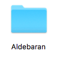

# Pepper Python チュートリアル

嶋田健志
(@TakesxiSximada)

---

## 今日のゴール

- [ ] Pepperの開発環境を構築する
- [ ] Pythonの開発環境を構築する
- [ ] Pepperを動かす
- [ ] Pepper + Pythonでプログラムを書いて実行する

---

## Pepperについてざっと説明

- ロボット
- 白い
- 目が大きい

---

## Pythonについてざっと説明

- スクリプト言語
- 最近機械学習のおかげですごい流行っている


---

## Choregrapheのインストール


---

## Choregrapheを起動する




---

## Choregrapheのライセンス入力画面

- ライセンスキーを持っていればライセンスキーを入力します。
- 今回は `試用期間を継続します。` を選択します。


---

## Choregrapheの起動画面

起動するとこのような画面になります。


---

## バーチャルロボットの設定

バーチャルロボットを使ってローカル環境でペッパーの操作ができるようにします。


---

## ポート番号を確認

- このポート番号につなぐことでPepperを遠隔で操作可能
- pynaoqiでは外部からPepperに接続してPepperを操作する機能が提供されている
- [pynaoqiのインストールガイド](http://doc.aldebaran.com/2-5/dev/python/install_guide.html)

---

## ライブラリへのパスの設定

- ${HOME}/src/var配下にtarballを展開した状態であることを前提としています。
- 必要に応じてパスを書き換えてください。

```
$ export PYTHONPATH=${PYTHONPATH}:${HOME}/src/var/pynaoqi-python2.7-2.5.5.5-mac64/lib/python2.7/site-packages
$ export DYLD_LIBRARY_PATH=${DYLD_LIBRARY_PATH}:${HOME}/src/var/pynaoqi-python2.7-2.5.5.5-mac64/lib
```

---

## naoqiが使えるかを確認する

naoqiをimportしてImportErrorがでなければOKです。

```
$ python
Python 2.7.13 (v2.7.13:a06454b1afa1, Dec 17 2016, 12:39:47)
[GCC 4.2.1 (Apple Inc. build 5666) (dot 3)] on darwin
Type "help", "copyright", "credits" or "license" for more information.
>>> import naoqi
>>>
```

---

## PepperにHello worldを言わせてみる

- naoqiを使ってPepperを操作する
- バーチャルロボットは音を発生させられない
- 発する音は文字列としてChoregrapheのダイアログに表示される


---

## PythonのInteractiveShellで実行

```
>>> from naoqi import ALProxy
>>> tts = ALProxy("ALTextToSpeech", "127.0.0.1", 54264)
[I] 1508488962.246104 775 qimessaging.session: Session listener created on tcp://0.0.0.0:0
[W] 1508488962.247009 4099 qi.path.sdklayout: No Application was created, trying to deduce paths
[I] 1508488962.247033 775 qimessaging.transportserver: TransportServer will listen on: tcp://10.27.4
0.30:55925
[I] 1508488962.247048 775 qimessaging.transportserver: TransportServer will listen on: tcp://127.0.0
.1:55925
[I] 1508488962.247056 775 qimessaging.transportserver: TransportServer will listen on: tcp://192.168
.99.1:55925
>>> tts.say("Hello, world!")
>>>
```

@[1] ALProxyをインポート
@[2] 第一引数はALTextToSpeech、第二引数はIPアドレス、第三引数はポート番号
@[3-7] 接続
@[8] テキスト "Hello world!" をPepperに送信


---

## ダイアログ


----

## 簡単なPepperチュートリアル

とりあえず何か話させてみる


---

## Pythonのインストール

- Python2.6
- PepperのPythonはバージョンが古い
- サードパーティライブラリがサポートを切りつつある

---

## 簡単なPythonチュートリアル

起動

```
$ python
```

---

## 簡単なPythonチュートリアル

1〜10までの数字を表示

```
>>> for ii in range(11): print ii
...
```


---

## あとは使って覚えよう


---

### Editing

- [Pythonデバッグ入門](https://gitpitch.com/TakesxiSximada/presentations/python-debug-tips)


---

## 参考文献

- http://doc.aldebaran.com/2-5/dev/python/install_guide.html
- http://doc.aldebaran.com/1-14/getting_started/helloworld_python.html
